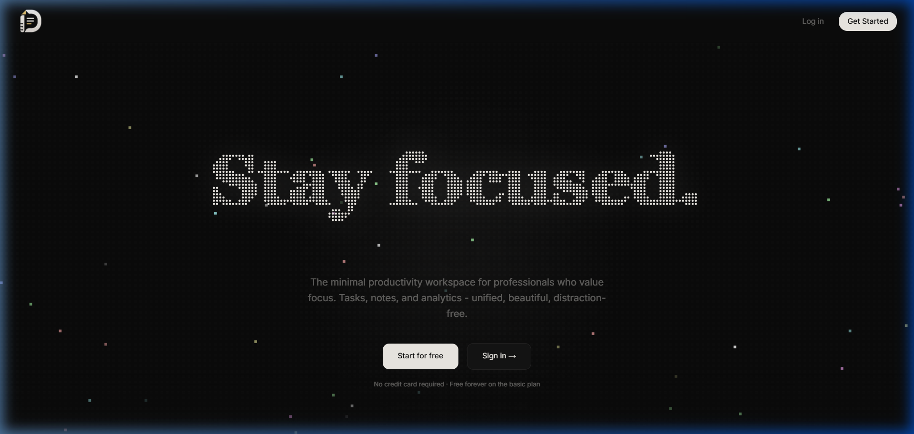
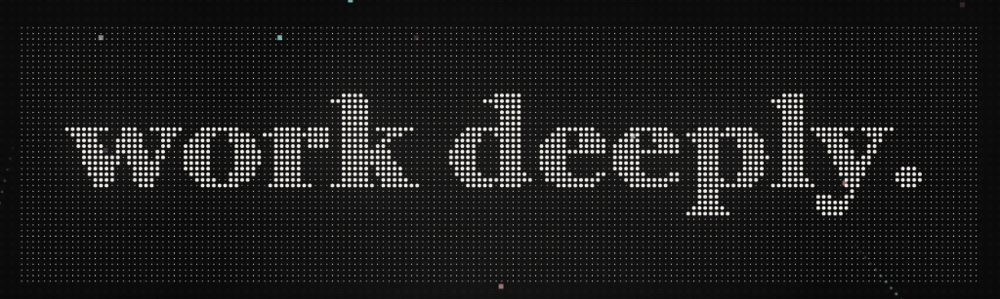

# **DAILYS**
### *The Minimal Productivity Workspace for Deep Work & Metrics*

  A distraction-free productivity environment uniting <b>daily execution</b>, <b>bi-directional knowledge</b>, <b>2D/3D force graphs</b>, and <b>outreach pipelines</b>.

 

 
 

---

  

---

## 🌌 Ethos & Design Philosophy

Most productivity workflows suffer from excessive tool switching: tasks in one app, documentation in another, CRM leads in spreadsheets, and focus timers in browser extensions. 

**Dailys** synthesizes these core engines into a single, cohesive canvas:

- **Zero Noise:** A deliberate dark-mode interface built on warm obsidian and midnight tones, eliminating notification fatigue and visual clutter.
- **Retro-Modern Typography:** Ambient pixel starfields, dynamic dot-matrix displays, and crisp monospace telemetry scales.
- **Interconnected Knowledge:** Tasks link directly to notes, notes connect to tags and projects, and everything forms an organic 2D/3D knowledge graph.
- **Execution Meets Outreach:** Manage not only what you build and reflect on, but track business outreach, pipeline conversion, and follow-ups.

---

## ⚡ Core System Modules

### 1. 🎯 Action Engine (Tasks & Daily Checklist)
- **Priority Matrix:** High, Medium, and Low priority classification with color-accented indicators.
- **Categorization:** Segment focus across *Work*, *Deep Work*, *Personal*, and *Health*.
- **Streak & Velocity Tracking:** Real-time daily progress counters and habit streaks to maintain momentum.
- **Seamless Inline Actions:** Keyboard-first task creation, completion toggles, and instant note linkage.

---

### 2. 📝 Thought Engine (Bi-Directional Rich Notes)
- **Tiptap Block Architecture:** Rich-text canvas supporting headers, formatted code blocks with syntax highlighting, bullet lists, blockquotes, and tables.
- **Slash (`/`) Commands:** Rapid block creation without taking your hands off the keyboard.
- **Inline Media & Asset Sync:** Drag-and-drop image uploads, persistent asset storage, and real-time JSONB state syncing.
- **Contextual Categorization:** Tag-based filtering and instant search across titles and content.

---

### 3. 🪐 Synapse Engine (2D & 3D Knowledge Graph)
- **Cosmic Force Simulation:** Visualizes your entire knowledge repository as an interconnected celestial constellation using D3-force physics.
- **Dual Dimensionality:** Toggle effortlessly between **2D flat graph canvas** and an interactive **3D WebGL orbital space** powered by Three.js.
- **Physics Customization:** Real-time control over gravitational center pull, link tension, and node repulsion.
- **Interactive Inspection:** Select any node to focus camera trajectory and open its linked note or task.

---

### 4. 📊 Growth Engine (Outreach CRM & Metric Tracker)
- **Pipeline Stages:** Monitor business leads across *Interested, Connected, Proposal, Call Booked, Won, and Lost*.
- **Activity & Touchpoint Logging:** Keep records of pitches, phone calls, and demonstration follow-ups.
- **Custom Saved Views:** Filter by overdue follow-ups, hot priorities, or website readiness for one-click access.
- **Conversion Metrics:** Track total outreach velocity, contact rates, and conversion health.

---

### 5. 📈 Insights & Productivity Analytics
- **30-Day Productivity Trends:** Visual charts detailing daily throughput and completion velocity.
- **Category Allocation:** Real-time visibility into how focus is distributed across different life domains.
- **Active Streaks:** Quantifiable metric history to evaluate consistency over time.

---

### 6. ⏱️ Time Engine (Focus Timer & Clock Modes)
- **Deep Work Sessions:** Integrated Pomodoro focus timer with ambient progress indicators.
- **4 Distinct Clock Displays:**
  - **Minimalist:** Ultra-clean typographic clock.
  - **Dot Matrix:** Nostalgic LED-grid second pulses.
  - **Circular Ring:** SVG radial progress visualization.
  - **Binary Matrix:** Sci-fi inspired second counter.

---

### 7. 🎨 Bento Layout Studio & Custom Theme Engine
- **Modular Dashboard:** Freely organize, reorder, and configure widgets according to your daily routine.
- **Palette Customization:** Built-in curated themes (*Obsidian, Midnight, Cyberpunk, Monokai, Tokyo Night*) alongside a live theme generator using HSL tokens.
- **Zero-Runtime Tokens:** Optimized with Tailwind CSS v4 `color-mix()` CSS variables for instant theme switching.

---

## 📱 Responsive Architecture

Designed for fluid transition across all form factors:
- **Mobile Experience:** Adaptive bottom navigation, compact touch-friendly cards, and responsive drawer sheets.
- **Tablet & Split-Screen:** Dynamic single-to-dual column reflow maintaining information hierarchy.
- **Ultrawide & Desktop:** High-density Bento grids leveraging expansive viewport widths.

---

Crafted for focus, clarity, and deliberate execution.

